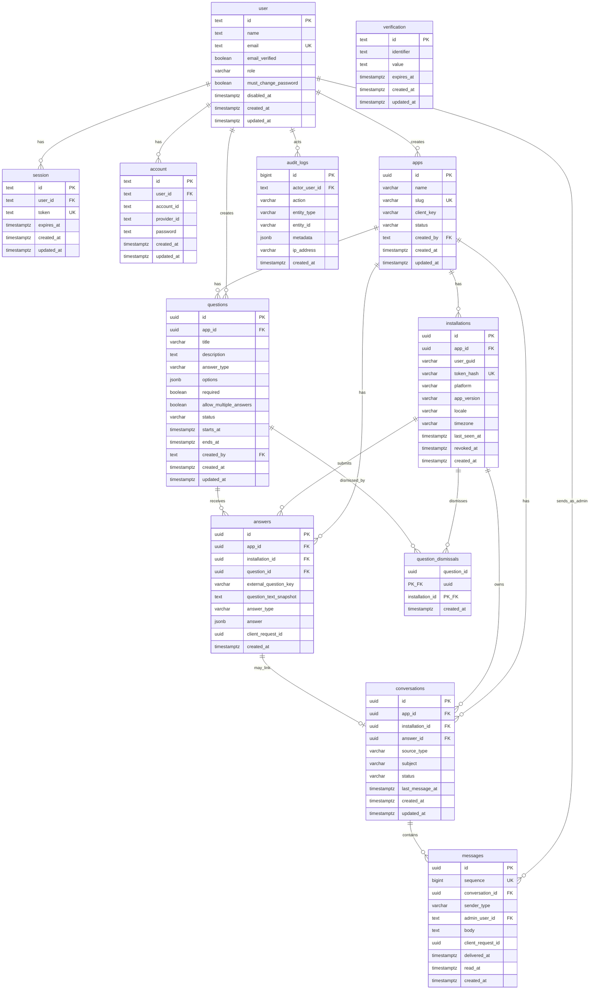

# Database schema

Feedback Hub uses PostgreSQL with Drizzle ORM. All timestamps are `timestamptz` stored in UTC. Domain tables use UUID primary keys except Better Auth tables, which use text IDs.

## Entity relationship diagram



## Better Auth tables

Managed by [Better Auth](https://www.better-auth.com/) with Drizzle adapter.

### `user`

Administrator accounts. Extended beyond Better Auth defaults:

| Column | Type | Description |
|--------|------|-------------|
| `id` | text | Primary key |
| `name` | text | Display name |
| `email` | text | Unique email (normalized lowercase) |
| `email_verified` | boolean | Email verification state |
| `image` | text | Optional avatar URL |
| `role` | varchar(20) | `superadmin`, `admin`, or `viewer` |
| `must_change_password` | boolean | Force password change on next login |
| `disabled_at` | timestamptz | Null when active; set when disabled |
| `created_at`, `updated_at` | timestamptz | Audit timestamps |

### `session`

Active admin sessions. `token` is unique; `expires_at` controls session lifetime.

### `account`

Credential and OAuth provider links. Password hashes for email/password login stored in `password` column with `provider_id = 'credential'`.

### `verification`

Email verification and password-reset tokens with expiration.

## Application tables

### `apps`

One row per mobile application integrated with Feedback Hub.

| Column | Type | Description |
|--------|------|-------------|
| `id` | uuid | Primary key |
| `name` | varchar(120) | Display name |
| `slug` | varchar(80) | Unique URL-safe identifier |
| `client_key` | varchar(120) | Plaintext client key for mobile registration |
| `status` | varchar(20) | `active` or `inactive` |
| `created_by` | text | FK → `user.id` |
| `created_at`, `updated_at` | timestamptz | Audit timestamps |

### `installations`

One row per `(app, userGuid)` pair — a logical mobile installation.

| Column | Type | Description |
|--------|------|-------------|
| `id` | uuid | Primary key |
| `app_id` | uuid | FK → `apps.id` |
| `user_guid` | varchar(128) | Client-generated stable local ID |
| `contact_email` | varchar(255) | Optional email for website visitors |
| `token_hash` | varchar(64) | SHA-256 hash of installation bearer token |
| `platform` | varchar(20) | `ios`, `android`, or `other` |
| `app_version` | varchar(40) | Client app version string |
| `locale` | varchar(20) | Client locale |
| `timezone` | varchar(80) | Client timezone |
| `last_seen_at` | timestamptz | Updated on sync |
| `revoked_at` | timestamptz | Null when active |
| `created_at` | timestamptz | First registration time |

**Unique constraints:** `(app_id, user_guid)`, `token_hash`

### `questions`

Remote survey questions belonging to an app.

| Column | Type | Description |
|--------|------|-------------|
| `id` | uuid | Primary key |
| `app_id` | uuid | FK → `apps.id` |
| `title` | varchar(200) | Question title shown to users |
| `description` | text | Optional longer description |
| `answer_type` | varchar(30) | See answer types below |
| `options` | jsonb | Choice options, e.g. `{ "choices": ["A","B"] }` |
| `required` | boolean | Whether answer is required |
| `allow_multiple_answers` | boolean | Allow same installation to answer again |
| `status` | varchar(20) | `draft`, `active`, `paused`, `archived` |
| `starts_at`, `ends_at` | timestamptz | Optional schedule window |
| `created_by` | text | FK → `user.id` |
| `created_at`, `updated_at` | timestamptz | Audit timestamps |

**Answer types:** `short_text`, `long_text`, `single_choice`, `multiple_choice`, `rating` (1–5), `yes_no`

### `answers`

Submitted question responses (remote or hardcoded).

| Column | Type | Description |
|--------|------|-------------|
| `id` | uuid | Primary key |
| `app_id` | uuid | FK → `apps.id` |
| `installation_id` | uuid | FK → `installations.id` |
| `question_id` | uuid | FK → `questions.id` (null for hardcoded) |
| `external_question_key` | varchar(120) | Hardcoded question key (null for remote) |
| `question_text_snapshot` | text | Text shown when answered |
| `answer_type` | varchar(30) | Answer type at submission time |
| `answer` | jsonb | Typed answer payload |
| `client_request_id` | uuid | Idempotency key |
| `created_at` | timestamptz | Submission time |

**Unique constraint:** `(installation_id, client_request_id)`

**Check constraint:** `question_id IS NOT NULL OR external_question_key IS NOT NULL`

### `conversations`

Feedback threads linked to an installation (and optionally an answer).

| Column | Type | Description |
|--------|------|-------------|
| `id` | uuid | Primary key |
| `app_id` | uuid | FK → `apps.id` |
| `installation_id` | uuid | FK → `installations.id` |
| `answer_id` | uuid | FK → `answers.id` (optional) |
| `source_type` | varchar(30) | `general_feedback` or `question_answer` |
| `subject` | varchar(200) | Conversation subject |
| `status` | varchar(30) | `open`, `waiting_for_user`, `closed` |
| `last_message_at` | timestamptz | For inbox ordering |
| `created_at`, `updated_at` | timestamptz | Audit timestamps |

### `messages`

Messages within a conversation. Admin replies sync to mobile via `sequence`.

| Column | Type | Description |
|--------|------|-------------|
| `id` | uuid | Primary key |
| `sequence` | bigint | Monotonic identity for sync cursor |
| `conversation_id` | uuid | FK → `conversations.id` |
| `sender_type` | varchar(30) | `mobile_user`, `admin`, or `system` |
| `admin_user_id` | text | FK → `user.id` when sender is admin |
| `body` | text | Message content (max 10,000 chars) |
| `client_request_id` | uuid | Idempotency key (mobile user messages) |
| `delivered_at` | timestamptz | Mobile delivery acknowledgment |
| `read_at` | timestamptz | Mobile read acknowledgment |
| `created_at` | timestamptz | Creation time |

**Unique constraint:** `(conversation_id, client_request_id)` where `client_request_id IS NOT NULL`

### `question_dismissals`

Tracks questions dismissed by an installation (not shown again in sync).

| Column | Type | Description |
|--------|------|-------------|
| `question_id` | uuid | PK, FK → `questions.id` |
| `installation_id` | uuid | PK, FK → `installations.id` |
| `created_at` | timestamptz | Dismissal time |

### `audit_logs`

Append-only security and business action log.

| Column | Type | Description |
|--------|------|-------------|
| `id` | bigint | Primary key (identity) |
| `actor_user_id` | text | FK → `user.id` (nullable for system) |
| `action` | varchar(100) | Action identifier, e.g. `app.created` |
| `entity_type` | varchar(50) | Entity type, e.g. `app`, `installation` |
| `entity_id` | varchar(100) | Entity identifier |
| `metadata` | jsonb | Additional context (no secrets) |
| `ip_address` | varchar(64) | Actor IP when available |
| `created_at` | timestamptz | Event time |

## Key relationships

1. **App → Installations → Conversations → Messages** — primary mobile feedback path.
2. **App → Questions → Answers** — remote survey flow; each answer creates a linked conversation.
3. **Installation + Question → Question dismissals** — prevents re-showing dismissed questions.
4. **User → Apps, Questions** — tracks which admin created resources.
5. **User → Audit logs** — tracks who performed administrative actions.

## Indexes

Notable indexes for query performance:

- `installations (app_id, user_guid)` — registration lookup
- `questions (app_id, status, starts_at, ends_at)` — active question sync
- `answers (app_id, created_at)`, `(question_id, created_at)` — admin list/export
- `conversations (app_id, status, last_message_at)` — inbox
- `conversations (installation_id, last_message_at)` — mobile conversation list
- `messages (conversation_id, sequence)`, `(sequence)` — sync and history
- `audit_logs (created_at)` — audit log pagination

## Migrations

Schema changes are applied via Drizzle migrations in `./drizzle`:

```bash
pnpm db:generate   # after schema.ts changes
pnpm db:migrate    # apply to database
```

Source of truth: `src/server/db/schema.ts`
